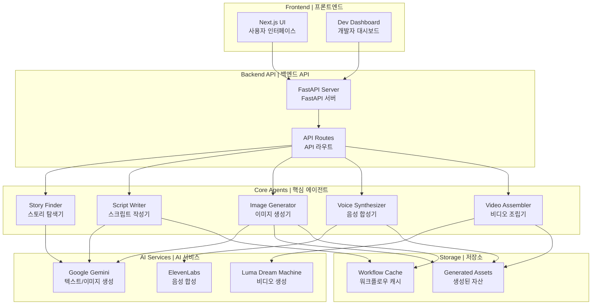
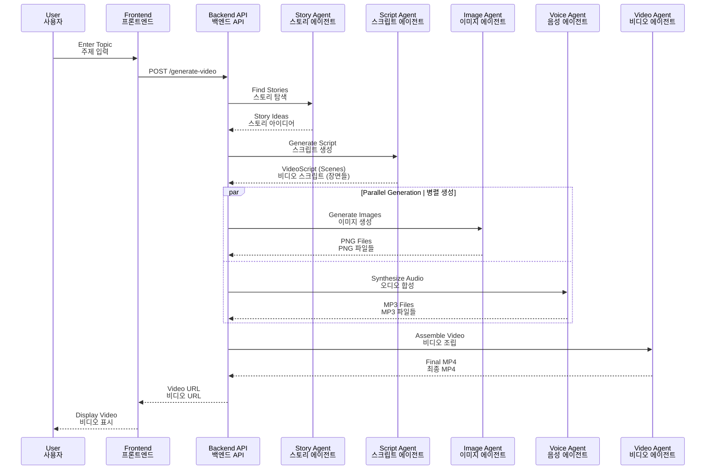
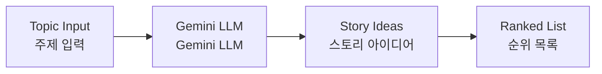
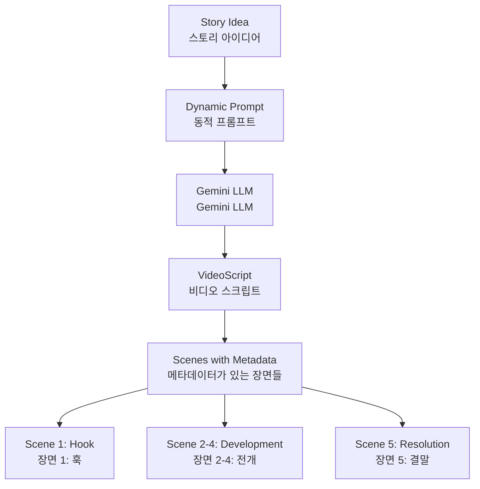
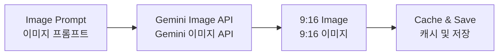
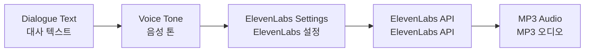
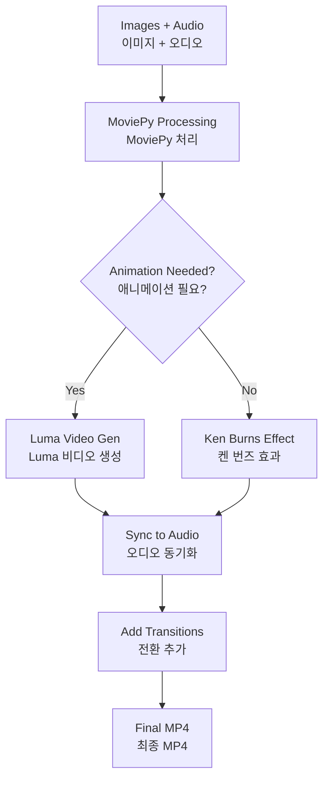

# ShortFactory - AI Video Generation Platform
# ShortFactory - AI 비디오 생성 플랫폼

[](https://www.python.org/)
[](https://fastapi.tiangolo.com/)
[](https://nextjs.org/)
[](LICENSE)

## 📖 Overview | 개요

**English:**
ShortFactory is an AI-powered platform that automatically generates short-form videos (YouTube Shorts, Instagram Reels) from text topics. It uses a multi-agent architecture with Google Gemini, ElevenLabs, and advanced video generation to create engaging educational content.

**한국어:**
ShortFactory는 텍스트 주제로부터 자동으로 숏폼 비디오(유튜브 쇼츠, 인스타그램 릴스)를 생성하는 AI 기반 플랫폼입니다. Google Gemini, ElevenLabs 및 고급 비디오 생성 기술을 활용한 멀티 에이전트 아키텍처를 사용하여 매력적인 교육 콘텐츠를 제작합니다.

---

## 🏗️ System Architecture | 시스템 아키텍처



---

## 🎬 Video Generation Pipeline | 비디오 생성 파이프라인



---

## 🚀 Quick Start | 빠른 시작

### Prerequisites | 필수 조건

**English:**
- Python 3.12+
- Node.js 20+
- API Keys: Google Gemini, ElevenLabs (optional: Luma)

**한국어:**
- Python 3.12 이상
- Node.js 20 이상
- API 키: Google Gemini, ElevenLabs (선택사항: Luma)

### Installation | 설치

```bash
# Clone repository | 저장소 복제
git clone https://github.com/yourusername/ShortFactoryLangChain.git
cd ShortFactoryLangChain

# Setup environment | 환경 설정
cp config/.env.example .env
# Edit .env with your API keys | API 키로 .env 편집

# Install dependencies | 의존성 설치
pip install -r requirements.txt
cd frontend && npm install && cd ..

# Start development servers | 개발 서버 시작
./start_dev.sh
```

### Access | 접속

- **Frontend | 프론트엔드**: http://localhost:3000
- **API Docs | API 문서**: http://localhost:8000/docs
- **Dev Dashboard | 개발자 대시보드**: http://localhost:3000/dev

---

## 📁 Project Structure | 프로젝트 구조

```
ShortFactoryLangChain/
├── src/                          # Backend source | 백엔드 소스
│   ├── agents/                   # AI Agents | AI 에이전트
│   │   ├── story_finder/         # Story generation | 스토리 생성
│   │   ├── script_writer/        # Script creation | 스크립트 작성
│   │   ├── image_gen/            # Image generation | 이미지 생성
│   │   ├── voice/                # Voice synthesis | 음성 합성
│   │   └── video_gen/            # Video assembly | 비디오 조립
│   ├── api/                      # FastAPI routes | FastAPI 라우트
│   ├── core/                     # Core utilities | 핵심 유틸리티
│   └── models/                   # Data models | 데이터 모델
├── frontend/                     # Next.js frontend | Next.js 프론트엔드
├── tests/                        # Test suites | 테스트 스위트
├── docs/                         # Documentation | 문서
│   ├── guides/                   # Developer guides | 개발자 가이드
│   ├── knowledge/                # Knowledge transfer | 지식 이전
│   └── API_DOCUMENTATION.md      # API reference | API 참조
├── scripts/                      # Utility scripts | 유틸리티 스크립트
├── docker/                       # Docker files | Docker 파일
├── config/                       # Configuration examples | 설정 예시
├── generated_assets/             # Output files | 출력 파일
└── tickets/                      # Feature tickets | 기능 티켓
```

---

## 🎯 Key Features | 주요 기능

### ✅ Implemented | 구현 완료

**English:**
- ✅ **Story Generation**: AI-powered topic discovery
- ✅ **Script Writing**: 5-part story arc with hooks
- ✅ **Image Generation**: 9:16 aspect ratio images
- ✅ **Voice Synthesis**: 13 emotional tones
- ✅ **Video Assembly**: Audio-synced video compilation
- ✅ **AI Video Generation**: Image-to-video with Luma
- ✅ **Resumable Workflows**: Checkpoint-based recovery
- ✅ **Dev Dashboard**: Real-time generation monitoring

**한국어:**
- ✅ **스토리 생성**: AI 기반 주제 발견
- ✅ **스크립트 작성**: 훅이 있는 5부 스토리 아크
- ✅ **이미지 생성**: 9:16 비율 이미지
- ✅ **음성 합성**: 13가지 감정 톤
- ✅ **비디오 조립**: 오디오 동기화 비디오 편집
- ✅ **AI 비디오 생성**: Luma를 통한 이미지-비디오 변환
- ✅ **재개 가능한 워크플로우**: 체크포인트 기반 복구
- ✅ **개발자 대시보드**: 실시간 생성 모니터링

---

## 🧠 AI Agents Detail | AI 에이전트 상세

### 1. Story Finder Agent | 스토리 탐색 에이전트



**Purpose | 목적**: Generate engaging story ideas from topics
**Features**:
- **Dynamic Personas**: Adapts to News, Real Story, Fiction, Educational categories.
- **Web Search**: Uses Tavily to find real-time facts for News/Real Stories.
**기능**: 주제로부터 매력적인 스토리 아이디어 생성, 웹 검색 및 동적 페르소나 적용

### 2. Script Writer Agent | 스크립트 작성 에이전트



**Features | 특징**:
- 5-part story arc | 5부 스토리 아크
- Hook techniques | 훅 기법
- Character consistency | 캐릭터 일관성
- Animation decisions | 애니메이션 결정

### 3. Image Generator Agent | 이미지 생성 에이전트



**Features | 특징**:
- Enforced 9:16 aspect ratio | 9:16 비율 강제
- Character consistency | 캐릭터 일관성
- Caching system | 캐싱 시스템

### 4. Voice Synthesizer Agent | 음성 합성 에이전트



**Voice Tones | 음성 톤**: Excited, Serious, Mysterious, Friendly, Dramatic, etc.
**음성 톤**: 흥분, 진지함, 신비로움, 친근함, 극적, 등

### 5. Video Assembler Agent | 비디오 조립 에이전트



---

## 🔧 Configuration | 설정

### Environment Variables | 환경 변수

```bash
# API Keys | API 키
GEMINI_API_KEY=your_gemini_key
ELEVENLABS_API_KEY=your_elevenlabs_key
TAVILY_API_KEY=your_tavily_key # Required for Story Finder search
LUMA_API_KEY=your_luma_key  # Optional | 선택사항

# Feature Flags | 기능 플래그
USE_REAL_LLM=true
USE_REAL_IMAGE=true
USE_REAL_VOICE=true

# Video Settings | 비디오 설정
VIDEO_RESOLUTION=1080p
VIDEO_FPS=30
IMAGE_ASPECT_RATIO=9:16
DEFAULT_SCENE_DURATION=8.0

# Video Generation | 비디오 생성
VIDEO_GENERATION_PROVIDER=mock  # or 'luma'
```

---

## 📊 Data Models | 데이터 모델

### VideoScript Model | 비디오 스크립트 모델

```python
class VideoScript(BaseModel):
    title: str                              # Video title | 비디오 제목
    main_character_description: str         # Character design | 캐릭터 디자인
    overall_style: str                      # Video style | 비디오 스타일
    scenes: List[Scene]                     # Scene list | 장면 목록
```

### Scene Model | 장면 모델

```python
class Scene(BaseModel):
    scene_number: int                       # Scene index | 장면 번호
    scene_type: SceneType                   # Scene category | 장면 유형
    dialogue: str                           # Narration text | 내레이션 텍스트
    voice_tone: VoiceTone                   # Emotional tone | 감정 톤
    image_create_prompt: str                # Image generation prompt | 이미지 생성 프롬프트
    needs_animation: bool                   # Animation flag | 애니메이션 플래그
    video_prompt: Optional[str]             # Video generation prompt | 비디오 생성 프롬프트
    transition_to_next: TransitionType      # Scene transition | 장면 전환
```

---

## 🧪 Testing | 테스트

```bash
# Run all tests | 모든 테스트 실행
pytest tests/

# Run specific test suite | 특정 테스트 스위트 실행
pytest tests/unit/
pytest tests/integration/

# Run with coverage | 커버리지와 함께 실행
pytest --cov=src tests/
```

---

## 📈 Performance | 성능

### Typical Generation Times | 일반적인 생성 시간

| Stage | Time | 단계 | 시간 |
|-------|------|------|------|
| Story Finding | ~5s | 스토리 탐색 | ~5초 |
| Script Writing | ~10s | 스크립트 작성 | ~10초 |
| Image Generation | ~30s (6 images) | 이미지 생성 | ~30초 (6개 이미지) |
| Voice Synthesis | ~20s | 음성 합성 | ~20초 |
| Video Assembly | ~60s | 비디오 조립 | ~60초 |
| **Total** | **~2-3 minutes** | **총합** | **~2-3분** |

---

## 🛠️ Development | 개발

### Running Tests | 테스트 실행

```bash
# Unit tests | 단위 테스트
python -m tests.unit.test_script_prompt_regression
python -m tests.unit.test_audio_quality
python -m tests.unit.test_image_aspect_ratio

# Integration tests | 통합 테스트
python -m tests.integration.test_video_generation_pipeline
```

### Code Quality | 코드 품질

```bash
# Linting | 린팅
ruff check src/

# Type checking | 타입 체킹
mypy src/

# Formatting | 포맷팅
black src/
```

---

## 📚 Documentation | 문서

- **API Documentation | API 문서**: http://localhost:8000/docs
- **Architecture Docs | 아키텍처 문서**: `/docs/`
- **Ticket History | 티켓 히스토리**: `/tickets/done/`
- **Test Documentation | 테스트 문서**: `/tests/README.md`

---

## 🤝 Contributing | 기여

**English:**
1. Fork the repository
2. Create a feature branch
3. Make your changes
4. Add tests
5. Submit a pull request

**한국어:**
1. 저장소 포크
2. 기능 브랜치 생성
3. 변경사항 작성
4. 테스트 추가
5. 풀 리퀘스트 제출

---

## 📝 License | 라이선스

MIT License - see LICENSE file for details
MIT 라이선스 - 자세한 내용은 LICENSE 파일 참조

---

## 🙏 Acknowledgments | 감사의 말

- Google Gemini for LLM and image generation
- ElevenLabs for voice synthesis
- Luma AI for video generation
- FastAPI and Next.js communities

---

**Built with ❤️ by the ShortFactory Team**
**ShortFactory 팀이 ❤️로 제작**
