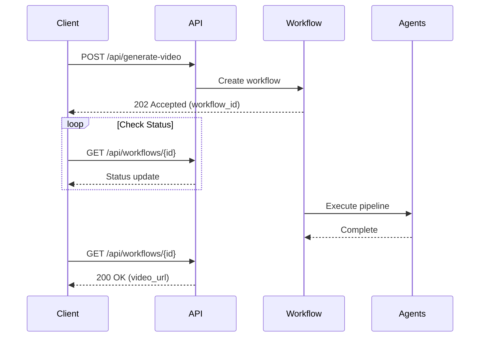

# API Documentation | API 문서
# ShortFactory Backend API Reference

**Base URL | 기본 URL**: `http://localhost:8000`  
**API Docs | API 문서**: `http://localhost:8000/docs`  
**Version | 버전**: 1.0.0

---

## 📋 Table of Contents | 목차

1. [Authentication](#authentication)
2. [Video Generation Endpoints](#video-generation-endpoints)
3. [Agent Endpoints](#agent-endpoints)
4. [Utility Endpoints](#utility-endpoints)
5. [Error Responses](#error-responses)
6. [Rate Limiting](#rate-limiting)

---

## 🔐 Authentication | 인증

**English**: Currently no authentication required for local development. Production deployment will use API keys.

**한국어**: 현재 로컬 개발에는 인증이 필요하지 않습니다. 프로덕션 배포 시 API 키를 사용합니다.

---

## 🎬 Video Generation Endpoints | 비디오 생성 엔드포인트

### 1. Generate Complete Video | 완전한 비디오 생성

```http
POST /api/generate-video
```

**Description | 설명**: Generate a complete video from a topic (full pipeline)  
**기능**: 주제로부터 완전한 비디오 생성 (전체 파이프라인)

**Request Body | 요청 본문**:
```json
{
  "topic": "Why do cats purr?",
  "language": "English",
  "max_scenes": 6,
  "use_real_apis": true
}
```

**Response | 응답**:
```json
{
  "video_url": "/generated_assets/videos/video_1732291234.mp4",
  "workflow_id": "wf_abc123",
  "duration_seconds": 48.5,
  "scenes_count": 6,
  "generation_time_seconds": 125.3,
  "metadata": {
    "title": "The Purrfect Mystery: Why Do Cats Purr?",
    "character": "Orange tabby cat with green eyes",
    "style": "educational-entertaining"
  }
}
```

**Status Codes | 상태 코드**:
- `200 OK`: Video generated successfully
- `400 Bad Request`: Invalid input parameters
- `500 Internal Server Error`: Generation failed

---

### 2. Generate Script Only | 스크립트만 생성

```http
POST /api/generate-script
```

**Description | 설명**: Generate video script without media generation  
**기능**: 미디어 생성 없이 비디오 스크립트만 생성

**Request Body | 요청 본문**:
```json
{
  "topic": "How does photosynthesis work?",
  "language": "English",
  "max_scenes": 5
}
```

**Response | 응답**:
```json
{
  "script": {
    "title": "The Magic of Photosynthesis",
    "main_character_description": "Friendly green leaf character...",
    "overall_style": "educational",
    "scenes": [
      {
        "scene_number": 1,
        "scene_type": "hook",
        "dialogue": "Ever wondered how plants make their own food?",
        "voice_tone": "curious",
        "image_create_prompt": "...",
        "needs_animation": true,
        "transition_to_next": "fade"
      }
    ]
  },
  "workflow_id": "wf_xyz789"
}
```

---

### 3. Resume Workflow | 워크플로우 재개

```http
POST /api/resume-workflow/{workflow_id}
```

**Description | 설명**: Resume a failed or interrupted workflow from last checkpoint  
**기능**: 마지막 체크포인트에서 실패하거나 중단된 워크플로우 재개

**Path Parameters | 경로 매개변수**:
- `workflow_id`: Workflow identifier from previous generation

**Response | 응답**:
```json
{
  "status": "resumed",
  "workflow_id": "wf_abc123",
  "last_checkpoint": "images_complete",
  "remaining_steps": ["voice_synthesis", "video_assembly"]
}
```

---

## 🤖 Agent Endpoints | 에이전트 엔드포인트

### 1. Story Finder | 스토리 탐색기

```http
POST /api/agents/story-finder
```

**Request | 요청**:
```json
{
  "topic": "Artificial Intelligence",
  "num_stories": 5
}
```

**Response | 응답**:
```json
{
  "stories": [
    {
      "title": "How AI Learns Like a Child",
      "hook": "What if computers could learn just like you did?",
      "engagement_score": 9.2
    }
  ]
}
```

---

### 2. Image Generator | 이미지 생성기

```http
POST /api/agents/image-generator
```

**Request | 요청**:
```json
{
  "prompt": "A curious orange cat looking at a butterfly",
  "scene_number": 1,
  "aspect_ratio": "9:16"
}
```

**Response | 응답**:
```json
{
  "image_url": "/generated_assets/images/scene_1_abc123.png",
  "dimensions": {
    "width": 1080,
    "height": 1920
  },
  "generation_time_seconds": 4.2
}
```

---

### 3. Voice Synthesizer | 음성 합성기

```http
POST /api/agents/voice-synthesizer
```

**Request | 요청**:
```json
{
  "text": "Hello, welcome to our video!",
  "voice_tone": "friendly",
  "scene_number": 1
}
```

**Response | 응답**:
```json
{
  "audio_url": "/generated_assets/audio/scene_1_voice.mp3",
  "duration_seconds": 3.5,
  "voice_settings": {
    "stability": 0.6,
    "similarity_boost": 0.85,
    "style": 0.4,
    "speed": 1.05
  }
}
```

---

## 🛠️ Utility Endpoints | 유틸리티 엔드포인트

### 1. Health Check | 상태 확인

```http
GET /health
```

**Response | 응답**:
```json
{
  "status": "healthy",
  "version": "1.0.0",
  "services": {
    "gemini": "connected",
    "elevenlabs": "connected",
    "storage": "ok"
  }
}
```

---

### 2. List Workflows | 워크플로우 목록

```http
GET /api/workflows
```

**Query Parameters | 쿼리 매개변수**:
- `status`: Filter by status (pending, running, completed, failed)
- `limit`: Number of results (default: 20)

**Response | 응답**:
```json
{
  "workflows": [
    {
      "workflow_id": "wf_abc123",
      "topic": "Why do cats purr?",
      "status": "completed",
      "created_at": "2025-11-22T10:30:00Z",
      "completed_at": "2025-11-22T10:32:15Z"
    }
  ],
  "total": 15,
  "page": 1
}
```

---

### 3. Get Workflow Status | 워크플로우 상태 조회

```http
GET /api/workflows/{workflow_id}
```

**Response | 응답**:
```json
{
  "workflow_id": "wf_abc123",
  "status": "running",
  "current_step": "voice_synthesis",
  "progress_percentage": 65,
  "checkpoints": [
    {
      "step": "script_generation",
      "completed_at": "2025-11-22T10:30:15Z",
      "status": "success"
    },
    {
      "step": "image_generation",
      "completed_at": "2025-11-22T10:31:45Z",
      "status": "success"
    }
  ],
  "estimated_completion": "2025-11-22T10:32:30Z"
}
```

---

## ❌ Error Responses | 오류 응답

### Error Format | 오류 형식

```json
{
  "error": {
    "code": "VALIDATION_ERROR",
    "message": "Invalid input parameters",
    "details": {
      "field": "max_scenes",
      "issue": "Must be between 3 and 10"
    },
    "request_id": "req_xyz789"
  }
}
```

### Error Codes | 오류 코드

| Code | HTTP Status | Description |
|------|-------------|-------------|
| `VALIDATION_ERROR` | 400 | Invalid request parameters |
| `WORKFLOW_NOT_FOUND` | 404 | Workflow ID doesn't exist |
| `API_KEY_MISSING` | 401 | Required API key not configured |
| `RATE_LIMIT_EXCEEDED` | 429 | Too many requests |
| `GENERATION_FAILED` | 500 | Video generation error |
| `SERVICE_UNAVAILABLE` | 503 | External API unavailable |

---

## 🚦 Rate Limiting | 속도 제한

**English**:
- **Development**: No rate limits
- **Production**: 10 requests per minute per IP
- **Headers**: `X-RateLimit-Remaining`, `X-RateLimit-Reset`

**한국어**:
- **개발**: 속도 제한 없음
- **프로덕션**: IP당 분당 10개 요청
- **헤더**: `X-RateLimit-Remaining`, `X-RateLimit-Reset`

---

## 📊 Request/Response Examples | 요청/응답 예시

### Complete Video Generation Flow | 완전한 비디오 생성 흐름



---

## 🔧 SDK Examples | SDK 예시

### Python Client | Python 클라이언트

```python
import requests

# Generate video
response = requests.post(
    "http://localhost:8000/api/generate-video",
    json={
        "topic": "Why is the sky blue?",
        "language": "English",
        "max_scenes": 5
    }
)

workflow = response.json()
print(f"Workflow ID: {workflow['workflow_id']}")

# Check status
status_response = requests.get(
    f"http://localhost:8000/api/workflows/{workflow['workflow_id']}"
)

status = status_response.json()
print(f"Progress: {status['progress_percentage']}%")
```

### JavaScript/TypeScript Client | JavaScript/TypeScript 클라이언트

```typescript
// Generate video
const response = await fetch('http://localhost:8000/api/generate-video', {
  method: 'POST',
  headers: { 'Content-Type': 'application/json' },
  body: JSON.stringify({
    topic: 'How do airplanes fly?',
    language: 'English',
    max_scenes: 6
  })
});

const workflow = await response.json();
console.log(`Workflow ID: ${workflow.workflow_id}`);

// Poll for completion
const checkStatus = async () => {
  const statusResponse = await fetch(
    `http://localhost:8000/api/workflows/${workflow.workflow_id}`
  );
  const status = await statusResponse.json();
  
  if (status.status === 'completed') {
    console.log(`Video ready: ${status.video_url}`);
  } else {
    setTimeout(checkStatus, 5000); // Check again in 5s
  }
};

checkStatus();
```

---

## 📝 Notes | 참고사항

**English**:
- All timestamps are in UTC ISO 8601 format
- File URLs are relative to the API base URL
- Workflows are automatically cleaned up after 7 days
- Maximum video length: 60 seconds
- Supported languages: English, Korean

**한국어**:
- 모든 타임스탬프는 UTC ISO 8601 형식
- 파일 URL은 API 기본 URL에 상대적
- 워크플로우는 7일 후 자동 정리
- 최대 비디오 길이: 60초
- 지원 언어: 영어, 한국어

---

**API Version | API 버전**: 1.0.0  
**Last Updated | 최종 업데이트**: 2025-11-22
