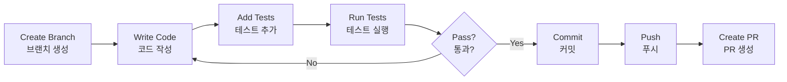

# Developer Guide | 개발자 가이드
# ShortFactory Development Guide

**Target Audience | 대상**: New developers joining the project  
**대상**: 프로젝트에 참여하는 신규 개발자

---

## 🎯 Quick Start | 빠른 시작

### Day 1: Setup | 1일차: 설정

```bash
# 1. Clone and setup | 복제 및 설정
git clone https://github.com/yourusername/ShortFactoryLangChain.git
cd ShortFactoryLangChain

# 2. Create environment file | 환경 파일 생성
cp .env.example .env
# Edit .env with your API keys | API 키로 .env 편집

# 3. Install dependencies | 의존성 설치
pip install -r requirements.txt
cd frontend && npm install && cd ..

# 4. Start development | 개발 시작
./start_dev.sh
```

### Day 2: Explore | 2일차: 탐색

1. **Read Documentation | 문서 읽기**:
   - `README.md` - Project overview
   - `project_knowledge_transfer.md` - Architecture deep dive
   - `docs/API_DOCUMENTATION.md` - API reference

2. **Try Dev Dashboard | 개발자 대시보드 사용**:
   - Visit http://localhost:3000/dev
   - Generate a test video
   - Observe the pipeline

3. **Review Code | 코드 검토**:
   - `src/agents/` - Agent implementations
   - `src/models/models.py` - Data models
   - `src/api/routes/` - API endpoints

---

## 📁 Code Organization | 코드 구성

### Directory Structure | 디렉토리 구조

```
src/
├── agents/              # AI Agents | AI 에이전트
│   ├── story_finder/    # Story generation
│   ├── script_writer/   # Script creation
│   ├── image_gen/       # Image generation
│   ├── voice/           # Voice synthesis
│   └── video_gen/       # Video assembly
│
├── api/                 # FastAPI Application
│   ├── main.py          # App initialization
│   └── routes/          # API endpoints
│
├── core/                # Core Utilities
│   ├── config.py        # Configuration
│   ├── logging.py       # Logging setup
│   └── workflow.py      # Workflow manager
│
└── models/              # Data Models
    └── models.py        # Pydantic models
```

---

## 🔧 Development Workflow | 개발 워크플로우

### Making Changes | 변경사항 작성



### Branch Naming | 브랜치 명명

```bash
# Feature branches | 기능 브랜치
feature/ticket-XXX-description

# Bug fixes | 버그 수정
fix/issue-description

# Documentation | 문서
docs/what-changed
```

### Commit Messages | 커밋 메시지

```bash
# Format | 형식
<type>: <description>

# Examples | 예시
feat: Add Luma video generation provider
fix: Correct image aspect ratio enforcement
docs: Update API documentation
test: Add unit tests for voice agent
refactor: Simplify workflow checkpoint logic
```

---

## 🧪 Testing Guide | 테스트 가이드

### Running Tests | 테스트 실행

```bash
# All tests | 모든 테스트
pytest tests/

# Unit tests only | 단위 테스트만
pytest tests/unit/

# Integration tests | 통합 테스트
pytest tests/integration/

# Specific test | 특정 테스트
pytest tests/unit/test_script_prompt_regression.py

# With coverage | 커버리지 포함
pytest --cov=src tests/
```

### Writing Tests | 테스트 작성

**Unit Test Example | 단위 테스트 예시**:
```python
import pytest
from src.agents.script_writer.agent import ScriptWriterAgent

@pytest.mark.asyncio
async def test_script_generation():
    """Test script generation with valid input."""
    agent = ScriptWriterAgent()
    
    script = await agent.generate_script(
        topic="Why is the sky blue?",
        language="English",
        max_scenes=5
    )
    
    assert script.title is not None
    assert len(script.scenes) == 5
    assert script.scenes[0].scene_type == "hook"
```

**Integration Test Example | 통합 테스트 예시**:
```python
@pytest.mark.asyncio
async def test_full_pipeline():
    """Test complete video generation pipeline."""
    from src.api.routes.video import generate_video
    
    result = await generate_video(
        topic="How do plants grow?",
        language="English",
        max_scenes=4
    )
    
    assert result["video_url"] is not None
    assert result["workflow_id"] is not None
    assert os.path.exists(result["video_url"])
```

---

## 🎨 Adding a New Agent | 새 에이전트 추가

### Step-by-Step | 단계별 가이드

**1. Create Agent Directory | 에이전트 디렉토리 생성**:
```bash
mkdir -p src/agents/my_agent
touch src/agents/my_agent/__init__.py
touch src/agents/my_agent/agent.py
```

**2. Implement Agent Class | 에이전트 클래스 구현**:
```python
# src/agents/my_agent/agent.py
import structlog
from src.core.config import settings

logger = structlog.get_logger()

class MyAgent:
    """Description of what this agent does."""
    
    def __init__(self):
        self.use_real = settings.USE_REAL_LLM
        logger.info("MyAgent initialized", use_real=self.use_real)
    
    async def process(self, input_data: str) -> str:
        """Process input and return result."""
        logger.info("Processing started", input_length=len(input_data))
        
        # Your logic here
        result = input_data.upper()
        
        logger.info("Processing completed", output_length=len(result))
        return result
```

**3. Add Tests | 테스트 추가**:
```python
# tests/unit/test_my_agent.py
import pytest
from src.agents.my_agent.agent import MyAgent

@pytest.mark.asyncio
async def test_my_agent():
    agent = MyAgent()
    result = await agent.process("hello")
    assert result == "HELLO"
```

**4. Integrate with API | API 통합**:
```python
# src/api/routes/my_route.py
from fastapi import APIRouter
from src.agents.my_agent.agent import MyAgent

router = APIRouter(prefix="/api/my-agent", tags=["my-agent"])

@router.post("/process")
async def process_data(data: str):
    agent = MyAgent()
    result = await agent.process(data)
    return {"result": result}
```

---

## 🐛 Debugging Tips | 디버깅 팁

### Logging | 로깅

```python
import structlog

logger = structlog.get_logger()

# Basic logging | 기본 로깅
logger.info("Operation started", operation="video_gen")

# With context | 컨텍스트 포함
logger.info(
    "Image generated",
    scene_number=1,
    dimensions=(1080, 1920),
    file_size_mb=2.3
)

# Error logging | 오류 로깅
try:
    result = risky_operation()
except Exception as e:
    logger.error(
        "Operation failed",
        error_type=type(e).__name__,
        error_message=str(e)
    )
```

### Using Dev Dashboard | 개발자 대시보드 사용

1. Navigate to http://localhost:3000/dev
2. Enter a test topic
3. Click "Generate Video"
4. Watch real-time logs in the console
5. Check generated files in `generated_assets/`

### Common Issues | 일반적인 문제

**Issue | 문제**: API key errors  
**Solution | 해결**: Check `.env` file has correct keys

**Issue | 문제**: Import errors  
**Solution | 해결**: Ensure virtual environment is activated

**Issue | 문제**: Port already in use  
**Solution | 해결**: Kill existing process or change port

---

## 📊 Performance Optimization | 성능 최적화

### Caching | 캐싱

```python
# Image caching example | 이미지 캐싱 예시
from pathlib import Path
import hashlib

def get_cache_key(prompt: str) -> str:
    """Generate cache key from prompt."""
    return hashlib.md5(prompt.encode()).hexdigest()

def check_cache(prompt: str) -> Path | None:
    """Check if image exists in cache."""
    cache_key = get_cache_key(prompt)
    cache_path = Path(f"cache/images/{cache_key}.png")
    
    if cache_path.exists():
        logger.info("Cache hit", cache_key=cache_key)
        return cache_path
    
    return None
```

### Async Operations | 비동기 작업

```python
import asyncio

# Parallel image generation | 병렬 이미지 생성
async def generate_all_images(scenes):
    tasks = [
        generate_image(scene.image_create_prompt)
        for scene in scenes
    ]
    return await asyncio.gather(*tasks)
```

---

## 🔐 Security Best Practices | 보안 모범 사례

### API Keys | API 키

```python
# ✅ Good | 좋음
from src.core.config import settings
api_key = settings.GEMINI_API_KEY

# ❌ Bad | 나쁨
api_key = "hardcoded-key-12345"
```

### Input Validation | 입력 검증

```python
from pydantic import BaseModel, Field, validator

class VideoRequest(BaseModel):
    topic: str = Field(..., min_length=5, max_length=200)
    max_scenes: int = Field(default=6, ge=3, le=10)
    
    @validator('topic')
    def topic_must_be_safe(cls, v):
        if any(char in v for char in ['<', '>', '&']):
            raise ValueError('Invalid characters in topic')
        return v
```

---

## 📚 Code Style Guide | 코드 스타일 가이드

### Python Style | Python 스타일

```python
# Follow PEP 8 | PEP 8 준수
# Use type hints | 타입 힌트 사용
# Document with docstrings | docstring으로 문서화

async def generate_video(
    topic: str,
    language: str = "English",
    max_scenes: int = 6
) -> dict:
    """
    Generate a complete video from a topic.
    
    Args:
        topic: The video topic
        language: Output language (default: English)
        max_scenes: Number of scenes (default: 6)
    
    Returns:
        dict: Video generation result with URL and metadata
    
    Raises:
        ValueError: If topic is invalid
        RuntimeError: If generation fails
    """
    # Implementation
    pass
```

### Naming Conventions | 명명 규칙

```python
# Classes | 클래스: PascalCase
class ScriptWriterAgent:
    pass

# Functions/Methods | 함수/메서드: snake_case
def generate_script():
    pass

# Constants | 상수: UPPER_SNAKE_CASE
MAX_SCENES = 10

# Private | 비공개: _prefix
def _internal_helper():
    pass
```

---

## 🚀 Deployment Checklist | 배포 체크리스트

### Pre-Deployment | 배포 전

- [ ] All tests passing | 모든 테스트 통과
- [ ] No hardcoded secrets | 하드코딩된 비밀 없음
- [ ] Documentation updated | 문서 업데이트
- [ ] Environment variables documented | 환경 변수 문서화
- [ ] Error handling comprehensive | 포괄적인 오류 처리
- [ ] Logging properly configured | 로깅 적절히 구성

### Post-Deployment | 배포 후

- [ ] Health check endpoint working | 상태 확인 엔드포인트 작동
- [ ] Monitoring dashboards configured | 모니터링 대시보드 구성
- [ ] Alerts set up | 알림 설정
- [ ] Backup strategy in place | 백업 전략 수립

---

## 🤝 Getting Help | 도움 받기

### Resources | 리소스

- **Documentation | 문서**: `/docs/` directory
- **API Reference | API 참조**: http://localhost:8000/docs
- **Code Examples | 코드 예시**: `/tests/` directory
- **Tickets | 티켓**: `/tickets/done/` for completed features

### Common Questions | 자주 묻는 질문

**Q: How do I add a new voice tone? | 새 음성 톤을 어떻게 추가하나요?**  
A: Add to `VoiceTone` enum in `src/models/models.py` and update `ElevenLabsSettings.for_tone()`

**Q: How do I change video resolution? | 비디오 해상도를 어떻게 변경하나요?**  
A: Update `VIDEO_RESOLUTION` in `.env` file

**Q: Where are generated files stored? | 생성된 파일은 어디에 저장되나요?**  
A: In `generated_assets/` directory (images, audio, videos)

---

**Happy Coding! | 즐거운 코딩 되세요!** 🚀
