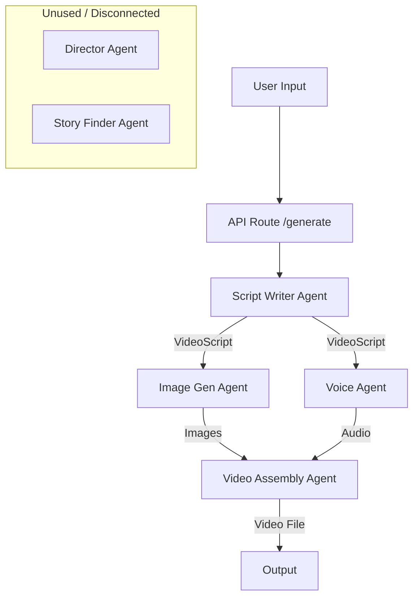

# Current Agent Architecture

## Overview

The current architecture relies on a linear pipeline where the **Script Writer** bears the heavy lifting of both narrative creation and visual prompting. The **Director Agent** exists in the codebase but is currently **disconnected** from the main video generation pipeline.

## Current Workflow

## Agent Responsibilities (Current)

### 1. Script Writer Agent (`src/agents/script_writer`)
- **Primary Duty:** Generates the entire video script.
- **Overloaded Duty:** Also responsible for writing detailed `image_prompts` and defining visual styles.
- **Input:** Subject, Language.
- **Output:** `VideoScript` (JSON) containing scenes, dialogue, and image prompts.

### 2. Image Gen Agent (`src/agents/image_gen`)
- **Primary Duty:** Generates images based on prompts provided by the Script Writer.
- **Logic:** Iterates through scenes (or visual segments) and calls the Image Generation API (Gemini/NanoBanana).
- **Output:** List of image file paths.

### 3. Voice Agent (`src/agents/voice`)
- **Primary Duty:** Generates audio voiceovers.
- **Logic:** Uses TTS (ElevenLabs) to convert dialogue to audio.
- **Output:** List of audio file paths.

### 4. Video Assembly Agent (`src/agents/video_assembly`)
- **Primary Duty:** Assembles assets into a final video.
- **Logic:** 
    - Concatenates images and audio.
    - Applies basic effects (Ken Burns) based on simple logic or Script Writer hints.
    - Handles dynamic visual segmentation (recently added).
- **Output:** Final MP4 file.

### 5. Director Agent (`src/agents/director`)
- **Status:** **Inactive / Unused**.
- **Capabilities:** Designed to analyze scripts, define shot types, camera movements, and emotional arcs, but currently not wired into the `videos.py` route.

### 6. Story Finder Agent (`src/agents/story_finder`)
- **Status:** **Standalone**.
- **Capabilities:** Can find stories based on topics, but the output is not automatically fed into the Script Writer in the main flow.

## Critical Issues
1.  **Overloaded Script Writer:** The Script Writer is distracted by visual details, leading to lower quality scripts or generic visuals.
2.  **Missing Director:** The "Director" logic (visual coherence, cinematic language) is implemented but ignored.
3.  **Disconnected Workflow:** Story Finder -> Script Writer handoff is manual or missing.
