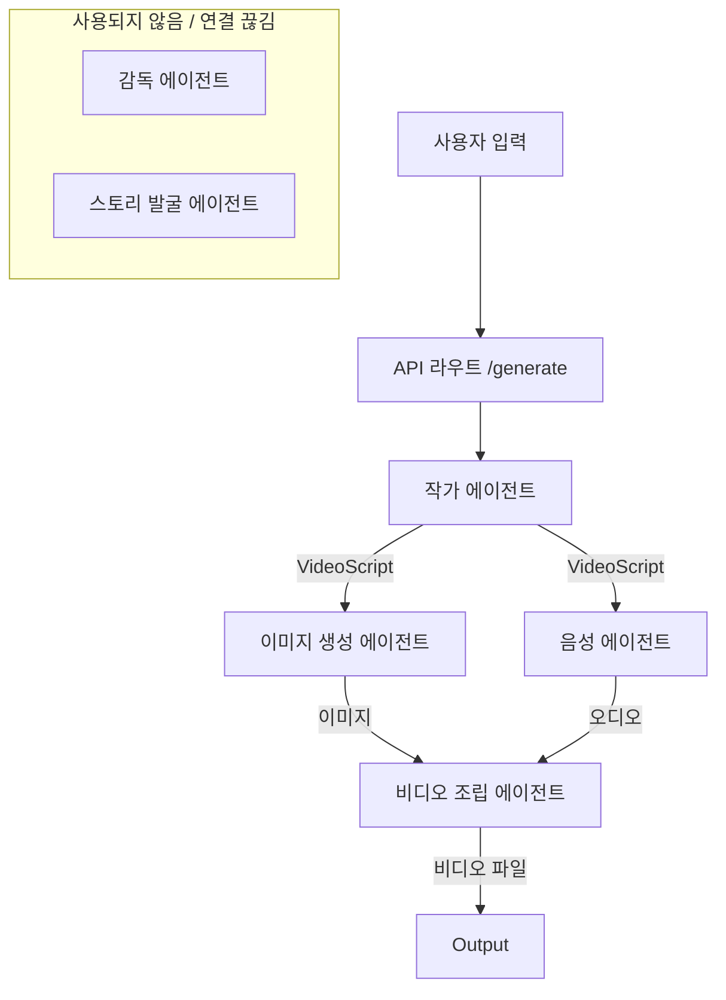

# 현재 에이전트 아키텍처 (Current Agent Architecture)

## 개요 (Overview)

현재 아키텍처는 **Script Writer(작가 에이전트)**가 스토리 작성과 시각적 프롬프트 작성이라는 두 가지 무거운 책임을 모두 떠안고 있는 선형적인 파이프라인에 의존하고 있습니다. **Director Agent(감독 에이전트)**는 코드베이스에 존재하지만, 현재 메인 비디오 생성 파이프라인과는 **연결되어 있지 않습니다**.

## 현재 워크플로우 (Current Workflow)

## 에이전트 별 역할 (Current Responsibilities)

### 1. Script Writer Agent (작가 에이전트)
- **주요 임무:** 전체 비디오 대본을 작성합니다.
- **과부하된 임무:** 상세한 `image_prompts`(이미지 프롬프트) 작성과 시각적 스타일 정의까지 담당하고 있습니다.
- **입력:** 주제, 언어.
- **출력:** `VideoScript` (장면, 대사, 이미지 프롬프트가 포함된 JSON).

### 2. Image Gen Agent (이미지 생성 에이전트)
- **주요 임무:** 작가 에이전트가 제공한 프롬프트를 바탕으로 이미지를 생성합니다.
- **로직:** 각 장면(또는 시각적 세그먼트)을 순회하며 이미지 생성 API를 호출합니다.
- **출력:** 이미지 파일 경로 목록.

### 3. Voice Agent (음성 에이전트)
- **주요 임무:** 성우 목소리(오디오)를 생성합니다.
- **로직:** TTS(ElevenLabs)를 사용하여 대사를 오디오로 변환합니다.
- **출력:** 오디오 파일 경로 목록.

### 4. Video Assembly Agent (비디오 조립 에이전트)
- **주요 임무:** 자산들을 모아 최종 비디오로 조립합니다.
- **로직:** 
    - 이미지와 오디오를 연결합니다.
    - 작가의 힌트나 단순 로직에 기반하여 기본 효과(Ken Burns 등)를 적용합니다.
    - 동적 시각적 분할(최근 추가됨)을 처리합니다.
- **출력:** 최종 MP4 파일.

### 5. Director Agent (감독 에이전트)
- **상태:** **비활성 / 미사용**.
- **능력:** 대본을 분석하고, 샷 종류, 카메라 움직임, 감정선을 정의하도록 설계되었으나, 현재 `videos.py` 라우트에 연결되어 있지 않습니다.

### 6. Story Finder Agent (스토리 발굴 에이전트)
- **상태:** **독립적**.
- **능력:** 주제에 따라 스토리를 찾을 수 있으나, 그 결과가 메인 흐름에서 작가 에이전트로 자동으로 전달되지 않습니다.

## 주요 문제점 (Critical Issues)
1.  **작가 에이전트의 과부하:** 작가가 시각적 세부 사항까지 신경 쓰느라 대본의 질이 떨어지거나 시각적 묘사가 일반적인 수준에 머무릅니다.
2.  **감독의 부재:** "감독" 로직(시각적 일관성, 영화적 연출)이 구현되어 있음에도 무시되고 있습니다.
3.  **단절된 워크플로우:** 스토리 발굴에서 작가로 이어지는 연결 고리가 수동적이거나 누락되어 있습니다.
