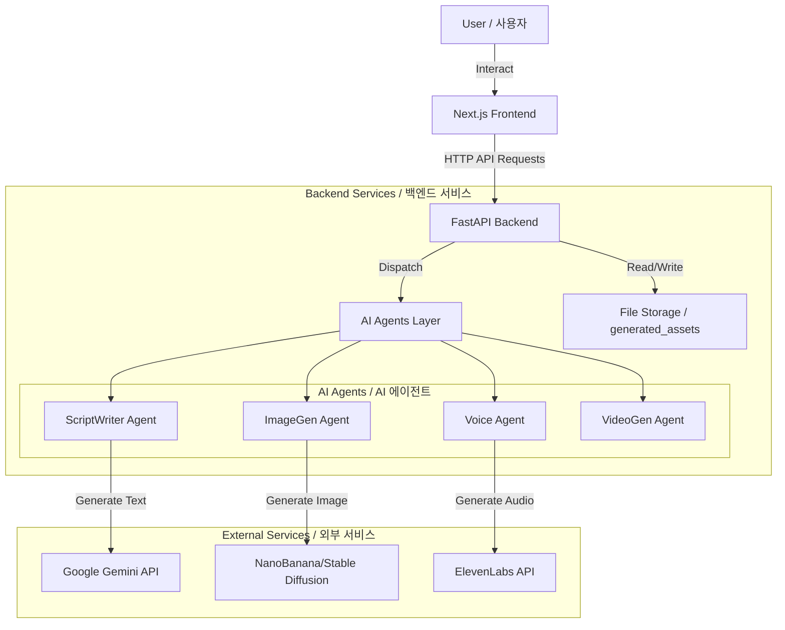
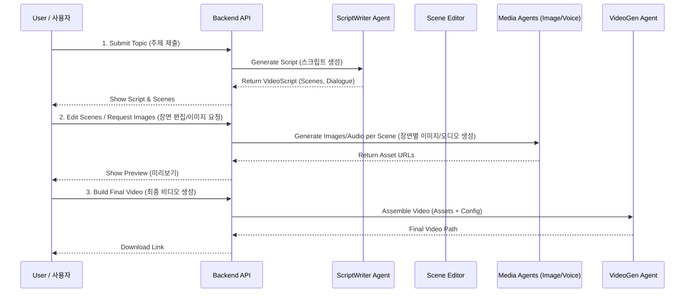

# Project Architecture & Logic Documentation / 프로젝트 아키텍처 및 로직 문서

This document provides a comprehensive overview of the ShortFactoryLangChain project's architecture, logical flow, and key components.
이 문서는 ShortFactoryLangChain 프로젝트의 아키텍처, 논리적 흐름 및 주요 구성 요소에 대한 포괄적인 개요를 제공합니다.

---

## 1. System Architecture / 시스템 아키텍처

The system follows a modern microservices-like architecture using FastAPI for the backend and Next.js for the frontend. It leverages AI agents for content generation.
시스템은 백엔드로 FastAPI를, 프론트엔드로 Next.js를 사용하는 현대적인 마이크로서비스 유사 아키텍처를 따릅니다. 콘텐츠 생성을 위해 AI 에이전트를 활용합니다.

### High-Level Architecture Diagram / 상위 레벨 아키텍처 다이어그램



### Components Description / 컴포넌트 설명

1.  **Frontend (Next.js)**:
    *   Provides the user interface for story input, script editing, and video preview.
    *   Communicates with the backend via RESTful APIs.
    *   **프론트엔드 (Next.js)**: 스토리 입력, 스크립트 편집, 비디오 미리보기를 위한 사용자 인터페이스를 제공합니다. RESTful API를 통해 백엔드와 통신합니다.

2.  **Backend (FastAPI)**:
    *   Handles API requests, manages data flow, and orchestrates AI agents.
    *   Exposes endpoints for stories, scripts, scene editing, and video generation.
    *   **백엔드 (FastAPI)**: API 요청을 처리하고 데이터 흐름을 관리하며 AI 에이전트를 조정합니다. 스토리, 스크립트, 장면 편집 및 비디오 생성을 위한 엔드포인트를 제공합니다.

3.  **AI Agents Layer**:
    *   Encapsulates logic for specific AI tasks (script writing, image generation, etc.).
    *   **AI 에이전트 계층**: 특정 AI 작업(스크립트 작성, 이미지 생성 등)에 대한 로직을 캡슐화합니다.

4.  **External APIs**:
    *   **Gemini**: Used for script generation and story ideation.
    *   **ElevenLabs**: Used for high-quality voice synthesis.
    *   **NanoBanana**: Used for image generation.
    *   **외부 API**: Gemini(스크립트 생성), ElevenLabs(음성 합성), NanoBanana(이미지 생성)를 사용합니다.

---

## 2. Video Generation Pipeline / 비디오 생성 파이프라인

The core logic of the application is the transformation of a user's idea into a complete video.
애플리케이션의 핵심 로직은 사용자의 아이디어를 완성된 비디오로 변환하는 것입니다.

### Workflow Diagram / 워크플로우 다이어그램



### Logical Steps / 논리적 단계

1.  **Script Generation (스크립트 생성)**:
    *   **Input**: Topic, Language, Duration.
    *   **Process**: `ScriptWriterAgent` uses Gemini to create a structured `VideoScript` containing multiple `Scenes`.
    *   **Validation**: The agent automatically validates and fixes common LLM errors (e.g., invalid enums for voice tone).
    *   **입력**: 주제, 언어, 길이.
    *   **과정**: `ScriptWriterAgent`가 Gemini를 사용하여 여러 `Scene`이 포함된 구조화된 `VideoScript`를 생성합니다.
    *   **검증**: 에이전트는 일반적인 LLM 오류(예: 잘못된 음성 톤 열거형)를 자동으로 검증하고 수정합니다.

2.  **Scene Editing & Asset Generation (장면 편집 및 자산 생성)**:
    *   **Scene Editor**: Users can modify the script, change image prompts, or upload their own videos for specific scenes.
    *   **Image Generation**: `ImageGenAgent` creates images based on the scene's visual description and style.
    *   **장면 편집기**: 사용자는 스크립트를 수정하거나, 이미지 프롬프트를 변경하거나, 특정 장면에 대해 자신의 비디오를 업로드할 수 있습니다.
    *   **이미지 생성**: `ImageGenAgent`는 장면의 시각적 설명과 스타일을 기반으로 이미지를 생성합니다.

3.  **Video Assembly (비디오 조립)**:
    *   **Process**: `VideoGenAgent` combines images, generated voiceovers, and background music.
    *   **Output**: A final MP4 video file.
    *   **과정**: `VideoGenAgent`는 이미지, 생성된 음성 해설, 배경 음악을 결합합니다.
    *   **출력**: 최종 MP4 비디오 파일.

---

## 3. Key Data Structures / 주요 데이터 구조

Understanding the data models is crucial for understanding the system logic.
데이터 모델을 이해하는 것은 시스템 로직을 이해하는 데 중요합니다.

### VideoScript & Scene

```python
class VideoScript(BaseModel):
    title: str
    scenes: List[Scene]
    # ...

class Scene(BaseModel):
    scene_number: int
    scene_type: SceneType          # e.g., HOOK, EXPLANATION
    dialogue: str                  # Text to be spoken / 말할 텍스트
    voice_tone: VoiceTone          # e.g., EXCITED, SERIOUS / 음성 톤
    image_create_prompt: str       # Prompt for image generation / 이미지 생성 프롬프트
    image_style: ImageStyle        # e.g., CINEMATIC, COMIC / 이미지 스타일
    # ...
```

---

## 4. Directory Structure / 디렉토리 구조

*   `src/agents`: Core logic for AI tasks. (AI 작업의 핵심 로직)
*   `src/api`: FastAPI routes and configuration. (FastAPI 라우트 및 설정)
    *   `routes/scene_editor.py`: Handles scene modification and asset generation. (장면 수정 및 자산 생성 처리)
*   `src/models`: Pydantic data models. (Pydantic 데이터 모델)
*   `frontend/`: Next.js application. (Next.js 애플리케이션)
*   `generated_assets/`: Stores generated images, audio, and videos. (생성된 이미지, 오디오, 비디오 저장)

---

## 5. Development & Deployment / 개발 및 배포

*   **Local Development**: Uses `start_dev.sh` to run both backend and frontend.
*   **Production**: Containerized using Docker, intended for Google Cloud Run.
*   **Environment**: Requires `.env` file with API keys (Gemini, ElevenLabs, etc.).
*   **로컬 개발**: `start_dev.sh`를 사용하여 백엔드와 프론트엔드를 모두 실행합니다.
*   **프로덕션**: Docker를 사용하여 컨테이너화되며, Google Cloud Run을 위해 설계되었습니다.
*   **환경**: API 키(Gemini, ElevenLabs 등)가 포함된 `.env` 파일이 필요합니다.
