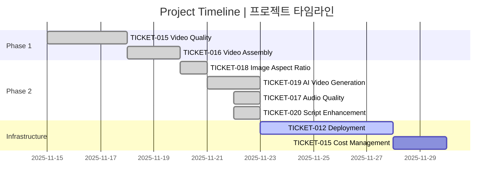
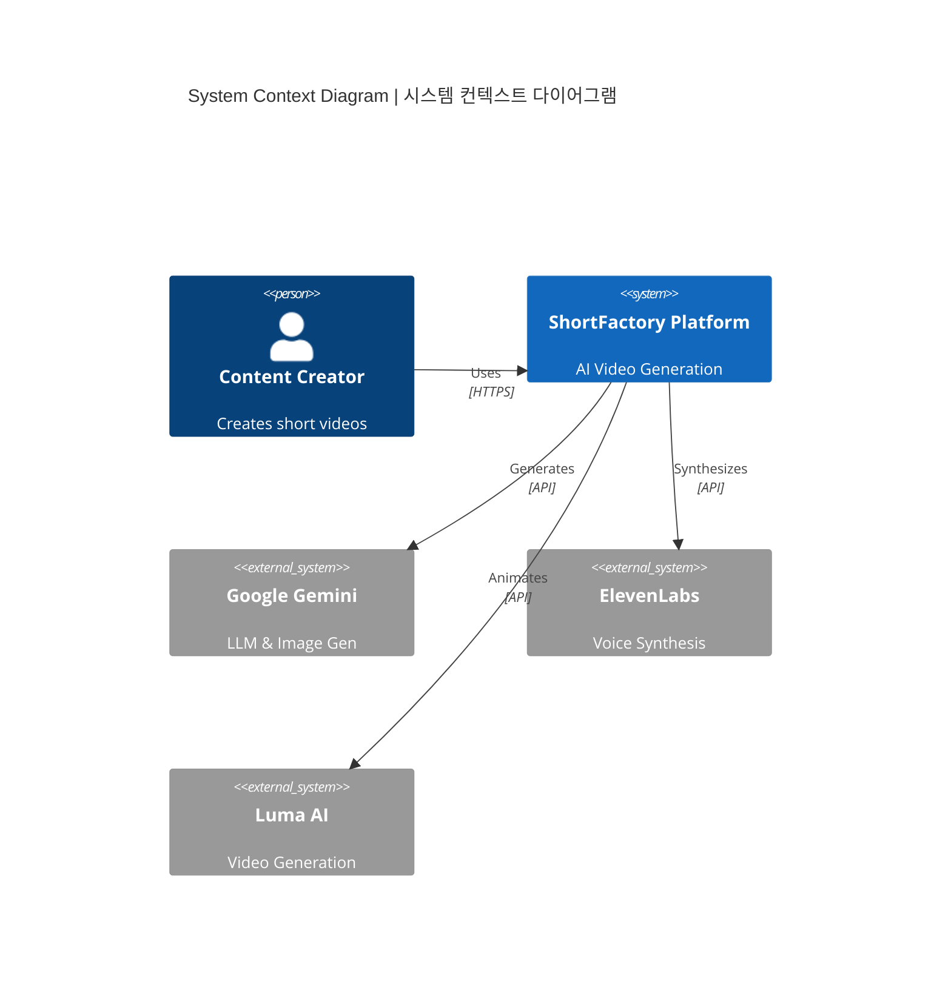
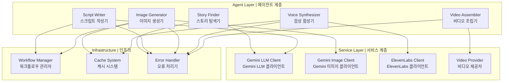
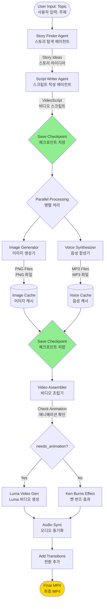
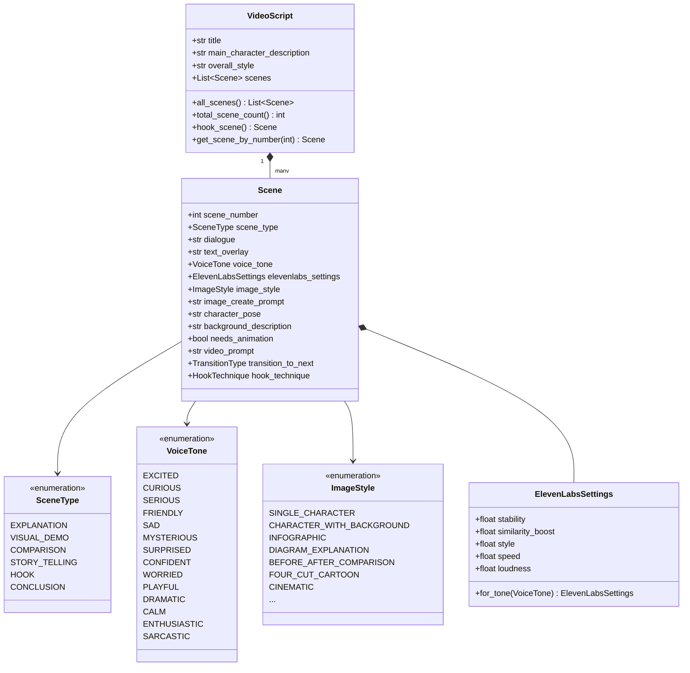
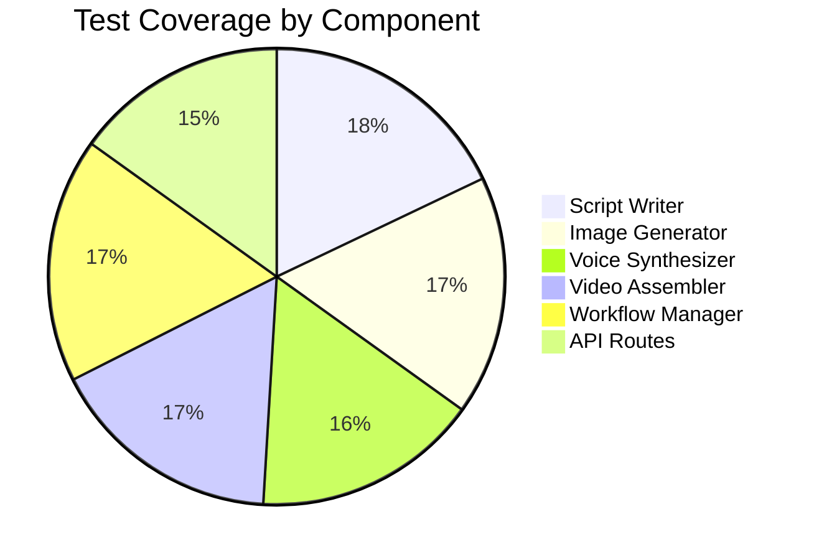
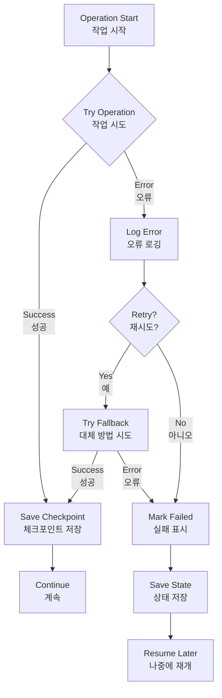

# ShortFactory - Project Knowledge Transfer
# ShortFactory - 프로젝트 지식 이전 문서

**Last Updated | 최종 업데이트**: November 22, 2025  
**Status | 상태**: Production Ready (Core Features Complete)  
**Completion | 완성도**: ~85%

---

## 📋 Executive Summary | 요약

### English
ShortFactory is a production-ready AI video generation platform that has successfully completed 6 major feature tickets. The system uses a sophisticated multi-agent architecture to transform text topics into engaging short-form videos (YouTube Shorts, Instagram Reels). All core agents are implemented and tested, with resumable workflows and comprehensive error handling.

### 한국어
ShortFactory는 6개의 주요 기능 티켓을 성공적으로 완료한 프로덕션 준비 완료 AI 비디오 생성 플랫폼입니다. 시스템은 정교한 멀티 에이전트 아키텍처를 사용하여 텍스트 주제를 매력적인 숏폼 비디오(유튜브 쇼츠, 인스타그램 릴스)로 변환합니다. 모든 핵심 에이전트가 구현 및 테스트되었으며, 재개 가능한 워크플로우와 포괄적인 오류 처리 기능을 갖추고 있습니다.

---

## 🎯 Current Status | 현재 상태

### Completed Features | 완료된 기능



### Feature Matrix | 기능 매트릭스

| Feature | Status | Quality | Notes |
|---------|--------|---------|-------|
| Story Finding | ✅ Complete | ⭐⭐⭐⭐⭐ | Gemini-powered topic discovery |
| Script Writing | ✅ Complete | ⭐⭐⭐⭐⭐ | 5-part story arc, 13 voice tones |
| Image Generation | ✅ Complete | ⭐⭐⭐⭐⭐ | 9:16 aspect ratio enforced |
| Voice Synthesis | ✅ Complete | ⭐⭐⭐⭐ | ElevenLabs integration |
| Video Assembly | ✅ Complete | ⭐⭐⭐⭐⭐ | Audio-synced compilation |
| AI Video Gen | ✅ Complete | ⭐⭐⭐⭐ | Luma/Mock providers |
| Resumable Workflows | ✅ Complete | ⭐⭐⭐⭐⭐ | Checkpoint-based recovery |
| Error Handling | ✅ Complete | ⭐⭐⭐⭐ | Comprehensive logging |

---

## 🏗️ Architecture Deep Dive | 아키텍처 심층 분석

### System Components | 시스템 구성 요소



### Agent Architecture | 에이전트 아키텍처



---

## 🔄 Data Flow | 데이터 흐름

### Complete Pipeline | 완전한 파이프라인



---

## 📊 Data Models | 데이터 모델

### Core Models Hierarchy | 핵심 모델 계층



---

## 🎨 Agent Details | 에이전트 상세

### 1. Story Finder Agent | 스토리 탐색 에이전트

**Purpose | 목적**: Generate engaging story ideas from user topics  
**기능**: 사용자 주제로부터 매력적인 스토리 아이디어 생성

**Implementation | 구현**:
- Uses Gemini 1.5 Flash LLM
- Generates 5-10 story ideas
- Ranks by engagement potential
- Returns top 3 ideas

**File | 파일**: `src/agents/story_finder/agent.py`

### 2. Script Writer Agent | 스크립트 작성 에이전트

**Purpose | 목적**: Create detailed video scripts with scene-by-scene breakdown  
**기능**: 장면별 세부 비디오 스크립트 생성

**Key Features | 주요 기능**:
- **5-Part Story Arc | 5부 스토리 아크**: Hook → Setup → Development → Climax → Resolution
- **Dynamic Prompts | 동적 프롬프트**: Auto-updates with enum changes
- **Character Consistency | 캐릭터 일관성**: Fixed character reference system
- **Animation Decisions | 애니메이션 결정**: Intelligent needs_animation flagging

**Prompt Structure | 프롬프트 구조** (600+ lines):
1. Agent Identity & Role
2. Story Arc Guidelines
3. Scene Type Definitions
4. Image Style Guidelines
5. Voice Tone Selection
6. Animation Framework
7. Character Consistency Rules
8. Transition Guidelines
9. Quality Checkpoints
10. Output Format (Pydantic Schema)

**File | 파일**: `src/agents/script_writer/prompts.py`

### 3. Image Generator Agent | 이미지 생성 에이전트

**Purpose | 목적**: Generate 9:16 aspect ratio images for each scene  
**기능**: 각 장면에 대한 9:16 비율 이미지 생성

**Features | 기능**:
- **Aspect Ratio Enforcement | 비율 강제**: Prompt engineering + dimension hints
- **Caching | 캐싱**: Avoids regenerating identical prompts
- **Checkpointing | 체크포인팅**: Saves progress per image
- **Character Consistency | 캐릭터 일관성**: Uses main_character_description

**Technical Details | 기술 세부사항**:
```python
# Aspect ratio enforcement
aspect_ratio = "9:16"
width, height = 1080, 1920
prompt = f"Create a {width}x{height} image with {aspect_ratio} aspect ratio..."
```

**File | 파일**: `src/agents/image_gen/agent.py`

### 4. Voice Synthesizer Agent | 음성 합성 에이전트

**Purpose | 목적**: Generate expressive voiceovers with emotional tones  
**기능**: 감정 톤이 있는 표현력 있는 보이스오버 생성

**Voice Tones | 음성 톤** (13 total):
- High Energy: Excited, Enthusiastic, Surprised, Dramatic
- Low Energy: Sad, Worried
- Neutral: Serious, Confident, Calm
- Engaging: Friendly, Curious, Playful
- Special: Mysterious, Sarcastic

**ElevenLabs Settings | ElevenLabs 설정**:
```python
# Example: Excited tone
stability=0.35        # Low for variation
similarity_boost=0.9  # High for quality
style=0.65           # Medium-high expressiveness
speed=1.15           # Faster delivery
loudness=0.2         # Slightly louder
```

**File | 파일**: `src/agents/voice/agent.py`

### 5. Video Assembler Agent | 비디오 조립 에이전트

**Purpose | 목적**: Combine images, audio, and animations into final video  
**기능**: 이미지, 오디오 및 애니메이션을 최종 비디오로 결합

**Processing Pipeline | 처리 파이프라인**:
1. Load images and audio
2. Check `needs_animation` flag
3. If true: Generate AI video (Luma)
4. If false: Apply Ken Burns effect
5. Sync video duration to audio length
6. Add transitions between scenes
7. Concatenate all clips
8. Export final MP4

**Supported Transitions | 지원되는 전환**:
- Fade, Dissolve
- Slide (Left/Right)
- Zoom (In/Out)
- Wipe, Push
- Spin, Flip

**File | 파일**: `src/agents/video_gen/agent.py`

---

## 🔧 Configuration System | 설정 시스템

### Environment Variables | 환경 변수

```python
class Settings(BaseSettings):
    # API Keys
    GEMINI_API_KEY: str
    ELEVENLABS_API_KEY: Optional[str]
    LUMA_API_KEY: Optional[str]
    
    # Feature Flags
    USE_REAL_LLM: bool = True
    USE_REAL_IMAGE: bool = True
    USE_REAL_VOICE: bool = True
    
    # Video Configuration
    VIDEO_RESOLUTION: str = "1080p"
    VIDEO_FPS: int = 30
    VIDEO_QUALITY: str = "medium"
    IMAGE_ASPECT_RATIO: str = "9:16"
    DEFAULT_SCENE_DURATION: float = 8.0
    
    # Video Generation
    VIDEO_GENERATION_PROVIDER: str = "mock"  # or "luma"
    
    # Voice Settings
    ELEVENLABS_VOICE_ID: str = "21m00Tcm4TlvDq8ikWAM"
    VOICE_SETTINGS_OVERRIDE: str = "{}"
```

---

## 🧪 Testing Strategy | 테스트 전략

### Test Coverage | 테스트 커버리지



### Test Types | 테스트 유형

**Unit Tests | 단위 테스트**:
- `test_script_prompt_regression.py`: Script generation validation
- `test_audio_quality.py`: Voice tone settings verification
- `test_image_aspect_ratio.py`: Aspect ratio enforcement
- `test_video_gen_provider.py`: Video provider integration

**Integration Tests | 통합 테스트**:
- `test_video_generation_pipeline.py`: End-to-end workflow
- `test_resumable_workflow.py`: Checkpoint recovery
- `test_error_handling.py`: Error scenarios

---

## 📈 Performance Metrics | 성능 지표

### Generation Times | 생성 시간

| Component | Average Time | 구성 요소 | 평균 시간 |
|-----------|--------------|----------|----------|
| Story Finding | 3-5s | 스토리 탐색 | 3-5초 |
| Script Writing | 8-12s | 스크립트 작성 | 8-12초 |
| Image Generation (6 scenes) | 25-35s | 이미지 생성 (6장면) | 25-35초 |
| Voice Synthesis | 15-25s | 음성 합성 | 15-25초 |
| Video Assembly | 45-75s | 비디오 조립 | 45-75초 |
| **Total Pipeline** | **2-3 minutes** | **전체 파이프라인** | **2-3분** |

### Resource Usage | 리소스 사용량

- **Memory | 메모리**: ~500MB-1GB during generation
- **CPU | CPU**: 2-4 cores recommended
- **Storage | 저장소**: ~50-100MB per video
- **API Costs | API 비용**: ~$0.10-0.30 per video

---

## 🚨 Error Handling | 오류 처리

### Error Recovery Strategy | 오류 복구 전략



### Checkpoint System | 체크포인트 시스템

**Checkpoint Locations | 체크포인트 위치**:
1. After script generation
2. After each image generation
3. After all images complete
4. After voice synthesis
5. Before video assembly

**Recovery Process | 복구 프로세스**:
```python
# Load checkpoint
workflow_state = workflow_manager.load_checkpoint(workflow_id)

# Resume from last successful step
if workflow_state.last_step == "images":
    # Skip script and images, start from voice
    continue_from_voice_synthesis()
```

---

## 🔐 Security & Best Practices | 보안 및 모범 사례

### API Key Management | API 키 관리

**English**:
- Never commit API keys to version control
- Use `.env` files (gitignored)
- Rotate keys regularly
- Use separate keys for dev/prod

**한국어**:
- API 키를 버전 관리에 커밋하지 않음
- `.env` 파일 사용 (gitignore됨)
- 정기적으로 키 교체
- 개발/프로덕션용 별도 키 사용

### Error Logging | 오류 로깅

```python
# Structured logging with request ID
logger.info(
    "Image generation started",
    scene_number=scene.scene_number,
    prompt_length=len(prompt),
    request_id=correlation_id.get()
)
```

---

## 📚 Additional Resources | 추가 자료

### Documentation Files | 문서 파일

- **README.md**: Main project documentation
- **docs/agents/**: Agent-specific documentation
- **docs/api/**: API endpoint documentation
- **tickets/done/**: Completed feature tickets
- **tests/README.md**: Testing guidelines

### External References | 외부 참조

- [Google Gemini API](https://ai.google.dev/)
- [ElevenLabs API](https://elevenlabs.io/docs)
- [Luma AI](https://lumalabs.ai/)
- [FastAPI Documentation](https://fastapi.tiangolo.com/)
- [Next.js Documentation](https://nextjs.org/docs)

---

## 🎓 Learning Path | 학습 경로

### For New Developers | 신규 개발자용

1. **Start Here | 여기서 시작**:
   - Read README.md
   - Review architecture diagrams
   - Run `./start_dev.sh`

2. **Understand Agents | 에이전트 이해**:
   - Study `src/agents/` directory
   - Review data models in `src/models/models.py`
   - Read agent documentation in `docs/agents/`

3. **Explore API | API 탐색**:
   - Visit http://localhost:8000/docs
   - Try Dev Dashboard at http://localhost:3000/dev
   - Review `src/api/routes/`

4. **Run Tests | 테스트 실행**:
   - `pytest tests/unit/`
   - `pytest tests/integration/`
   - Review test files for examples

---

## 🔮 Future Roadmap | 향후 로드맵

### Planned Features | 계획된 기능

- [ ] Production deployment (Docker + Cloud Run)
- [ ] Cost management & monitoring
- [ ] Multi-language support
- [ ] Custom character upload
- [ ] Batch video generation
- [ ] Video templates
- [ ] Analytics dashboard

---

**Document Version | 문서 버전**: 2.0  
**Last Updated | 최종 업데이트**: 2025-11-22  
**Maintained By | 관리자**: ShortFactory Team